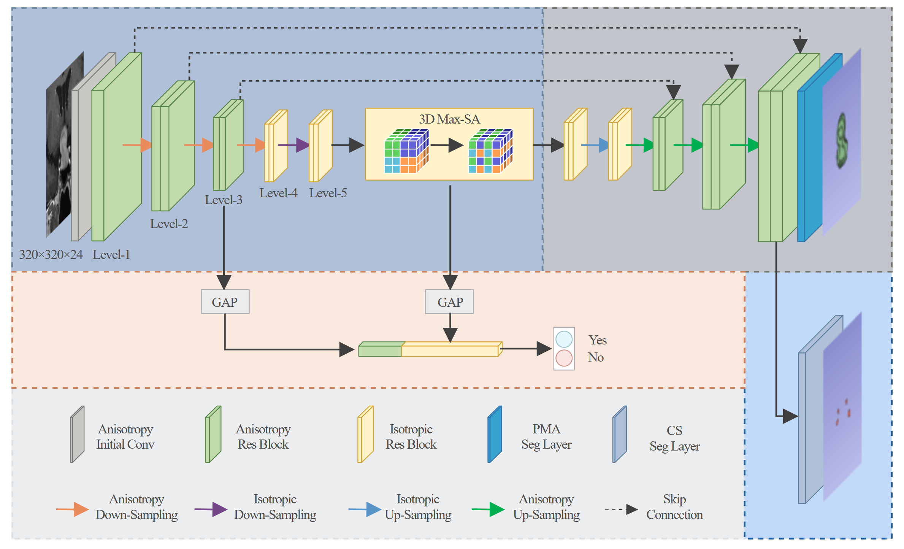

# MTMAUNet

**MTMAUNet:** **M**ulti-**T**ask **M**ulti-axis **A**ttention **U**Net



## Environment

```
pytorch>=1.6
monai>=1.0.0
accelerate>=0.5.0
```

## Inference

Configure ***configs/Config.yaml***

```
dataset:
    test: ./test.csv   # your infer csv path
val_model: ./checkpoint.pth.tar  # weight file

```

test.csv file example, It is better to use absolute position

```
/dataset/img/img_001.nii.gz
/dataset/img/img_002.nii.gz
```

Run command

```
python infer.py
```

## Training or verification

Configure ***configs/Config.yaml***

```
dataset:
    root: ./dataset_dir # your dataset path 
    cv:
        dir_name: cv  # your fold csv dir
        fold: 0 # your fold k
    split: 
        train: train.csv  # your train csv name
        val: val.csv # your val csv name
```

train.csv or val.csv file example, use a relative location to `dataset.root`

```
img_001.nii.gz, seg_001.nii.gz, 0
img_002.nii.gz, seg_002.nii.gz, 1
```

Run command

```
python train.py   # train
python val.py     # val
```

## Acknowledgement

Code based on DynUNet in  [monai](https://github.com/Project-MONAI/MONAI).


Code based on 3D-MaxViT-pytorch in  [3D-MaxViT-pytorch](https://github.com/nengwp/3D-MaxViT-pytorch).


